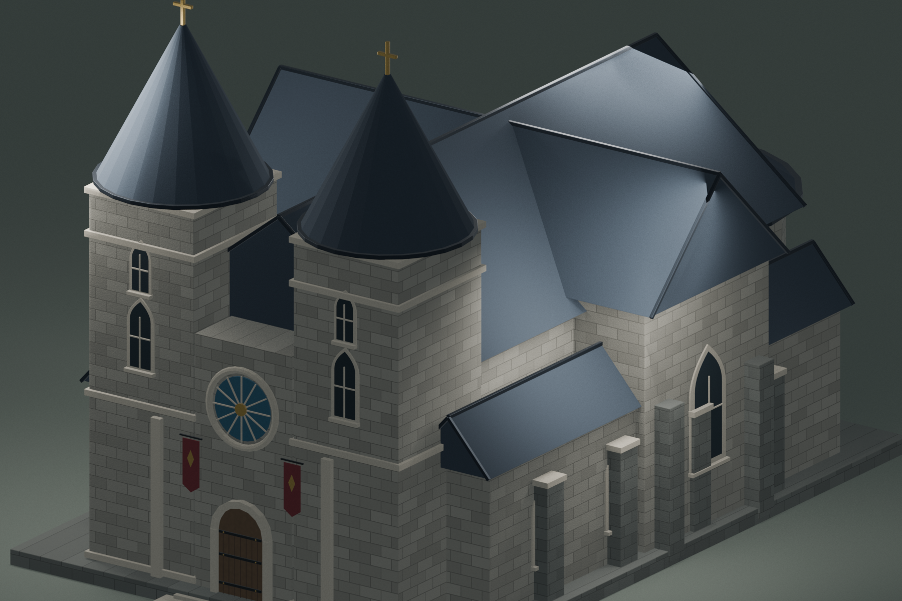
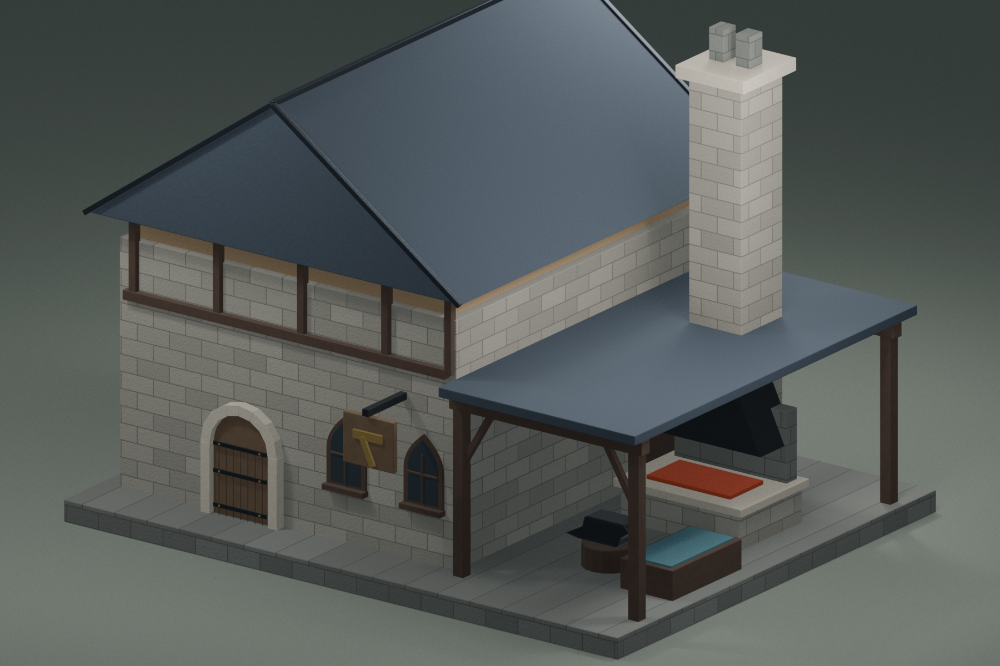
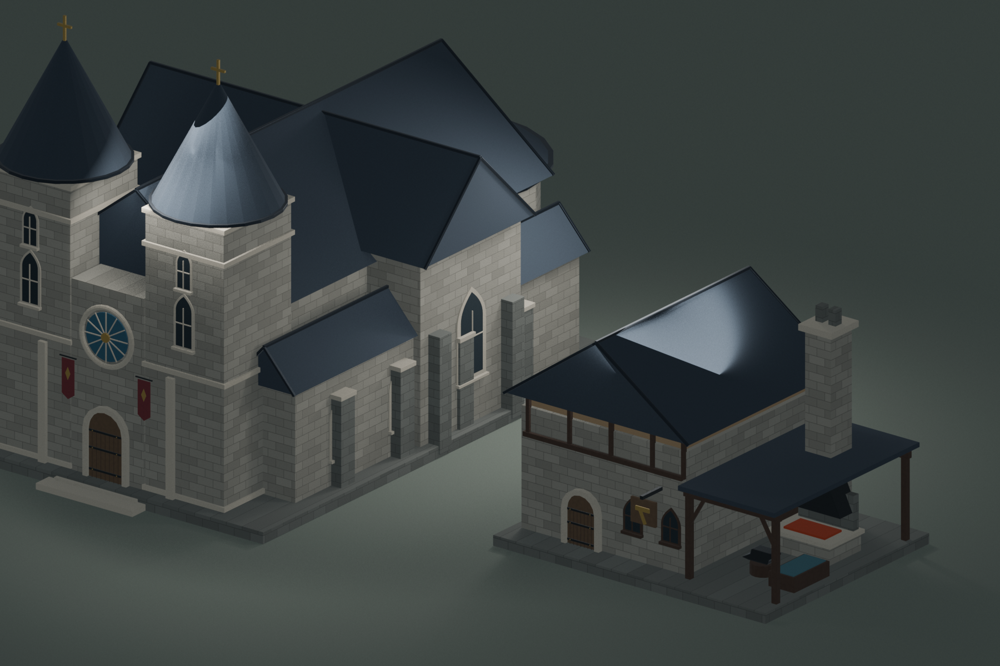

# 教会・鍛冶屋 Blender原本

既存のリアル寄りファンタジー建築と同じマテリアル体系・1 Blender unit = 1mで作成した、Unity取り込み前のBlender原本。

- `Church`: 双塔、身廊、側廊、翼廊、後陣、薔薇窓を持つ都市の主要教会。既存の小規模な`Chapel`とは別施設。
- `Blacksmith`: 石造工房、開放式の炉、煙突、金床、焼入れ槽、工具棚を一体化した鍛冶屋。既存の単体`Forge`を建物へ拡張した施設。

検証時の外形は教会が約19.34×31.68×21.75m、鍛冶屋が約15.88×12.58×12.32m。教会は199メッシュ部品・28,132三角形、鍛冶屋は87メッシュ部品・9,756三角形で構成している。

原本は `ArtSource/Blender/FantasyChurchAndBlacksmith.blend`。`Editable Assets`シーンの`Church`・`Blacksmith`コレクションに、編集可能な部品単位で格納している。確認用の3シーンも同じファイルに含む。







## 再生成・検証

```sh
/Applications/Blender.app/Contents/MacOS/Blender --background --factory-startup --python-exit-code 1 --python Tools/Blender/generate_fantasy_church_blacksmith.py
/Applications/Blender.app/Contents/MacOS/Blender --background --python-exit-code 1 --python Tools/Blender/validate_fantasy_church_blacksmith.py
```

今回はBlender制作までを範囲とし、FBX書き出し、テクスチャベイク、Unity用Prefab作成、Countryへの配置は行っていない。
