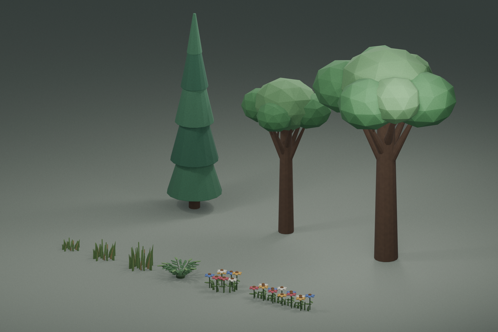
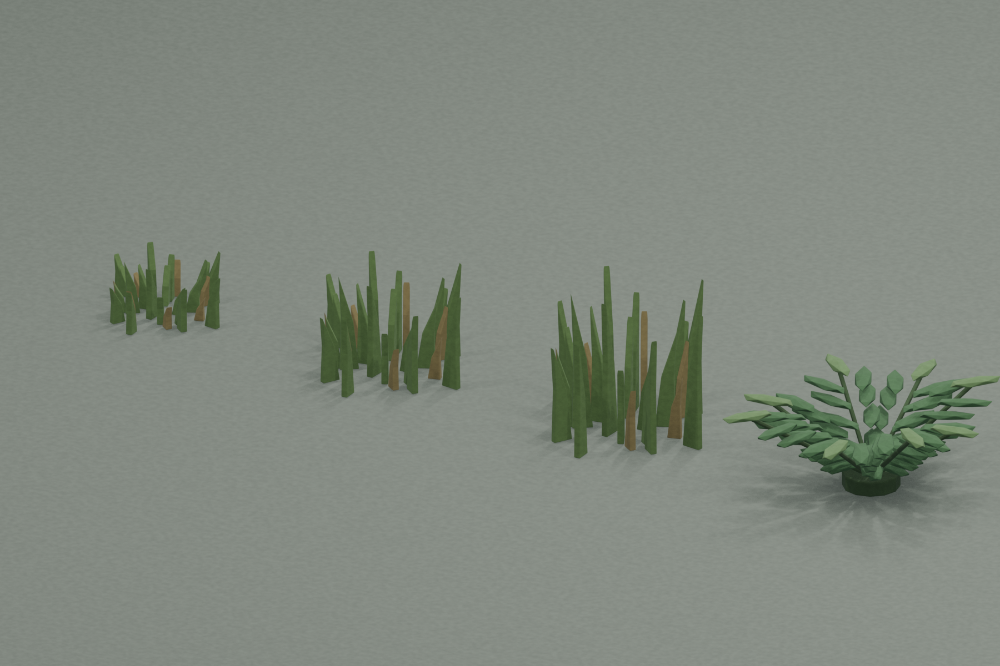
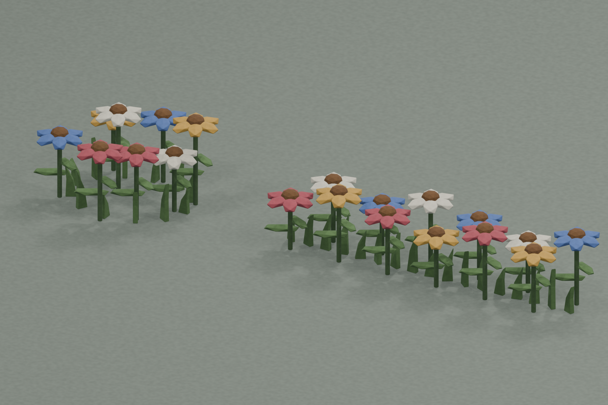
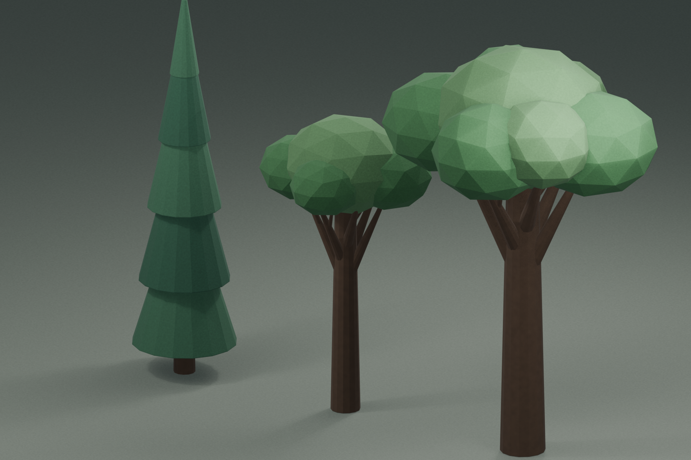

# ファンタジー都市用植栽 Blender原本

建物同士、石畳際、道路沿い、広場などの空地を埋めるための非発光3D植栽セット。すべて地面へ直接置ける接地状態で、部品単位に編集できるBlenderコレクションとして保存している。

- `GroundPlant_GrassShort`: 石畳の目地や道端用の短い草。
- `GroundPlant_GrassTuft`: 建物際や空き地用の中くらいの草。
- `GroundPlant_GrassTall`: 未整備地や城壁際用の高い草。
- `GroundPlant_FernPatch`: 日陰や建物裏用のシダ。
- `Flower_WildPatch`: 民家前や小広場用の野花群。
- `Flower_Border`: 壁沿い・道路沿い用の帯状花壇。
- `Tree_AlleyCypress`: 狭い路地や門周辺用の細い常緑樹。
- `Tree_Street`: 街路や中庭用の中型樹。幹と先細りの枝が樹冠内部まで接続する。
- `Tree_Shade`: 広場や公共施設脇用の大きな木。幹と先細りの枝が樹冠内部まで接続する。

原本は `ArtSource/Blender/FantasyCityVegetation.blend`。`Editable Vegetation Assets`シーンに編集用コレクション、別シーンにカテゴリ別と全体のプレビューを保存している。









## 再生成・検証

```sh
/Applications/Blender.app/Contents/MacOS/Blender --background --factory-startup --python-exit-code 1 --python Tools/Blender/generate_fantasy_city_vegetation.py
/Applications/Blender.app/Contents/MacOS/Blender --background --python-exit-code 1 --python Tools/Blender/validate_fantasy_city_vegetation.py
```

今回はBlender制作までを範囲とし、FBX出力とUnity配置は行っていない。
