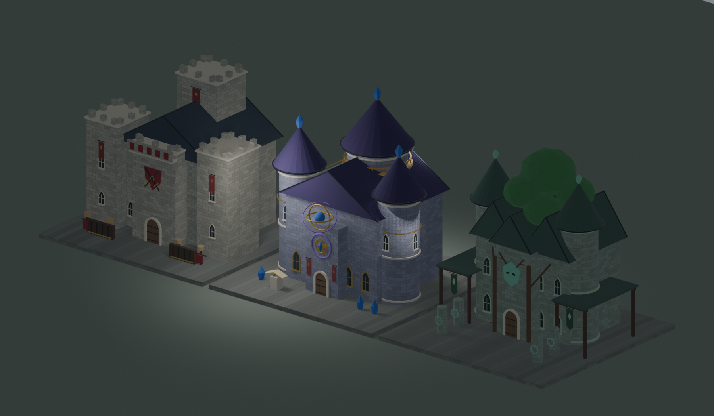
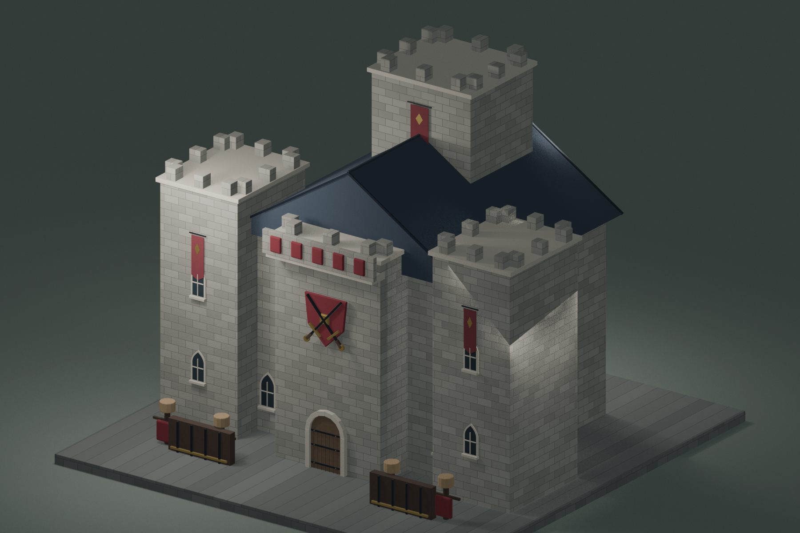
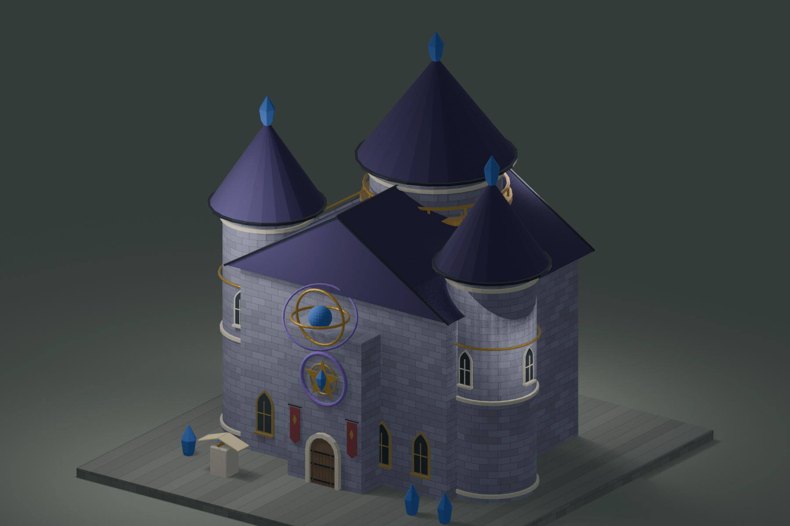
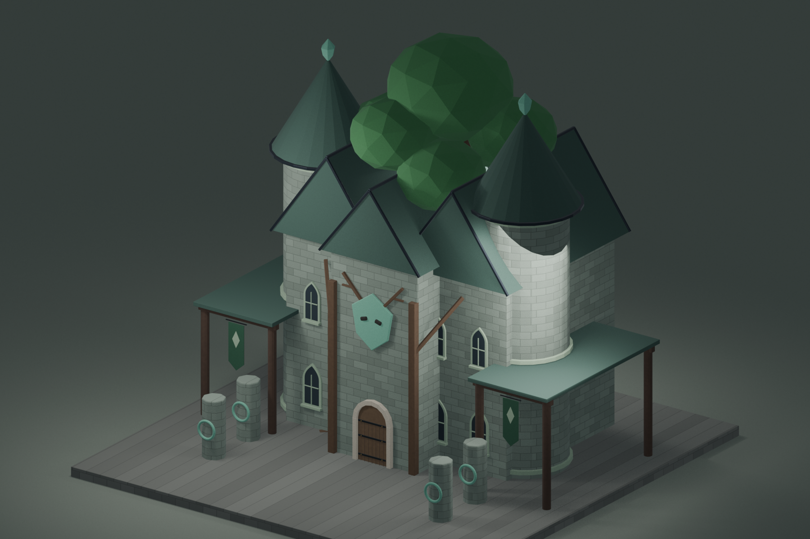

# ファンタジー学校3種 Blender原本

王国へ追加する教育施設を、既存のリアル寄りファンタジー建築と同じ縮尺・マテリアル方針で制作したBlender原本。3校の敷地は同じ大きさに揃え、建物名を表示しなくても外形と前庭設備から学校の種類を判別できるようにしている。魔法表現を含め、すべて非発光マテリアルを使用している。

- `WarriorAcademy`（戦士学校）: 高い軍旗塔、教官用の閲兵台、胸壁付き訓練塔、剣盾紋章、訓練人形、武器棚、赤い軍旗。
- `ArcaneAcademy`（魔法学校）: 高さの異なる3本の魔術塔、天文観測台、塔を結ぶ空中回廊、五芒星魔法陣、三重の空中儀、開いた呪文書、紫紺の尖塔屋根。
- `SpiritAcademy`（精霊使役学校）: 双塔を備えた大聖堂、校舎中央を貫く巨大な聖樹、守護精霊面、露出した根、葉紋章の緑旗。前庭の独立した召喚オブジェクトは置かない。

原本は `ArtSource/Blender/FantasySchools.blend`。`Editable Assets`シーンの各コレクションに編集可能な部品単位で格納し、個別プレビュー3シーンと比較用シーンも同じファイルへ保存している。









## 再生成・検証

```sh
/Applications/Blender.app/Contents/MacOS/Blender --background --factory-startup --python-exit-code 1 --python Tools/Blender/generate_fantasy_schools.py
/Applications/Blender.app/Contents/MacOS/Blender --background --python-exit-code 1 --python Tools/Blender/validate_fantasy_schools.py
```

今回はBlender制作までを範囲とし、FBX書き出し、テクスチャベイク、Unity用Prefab作成、Countryへの配置は行っていない。
