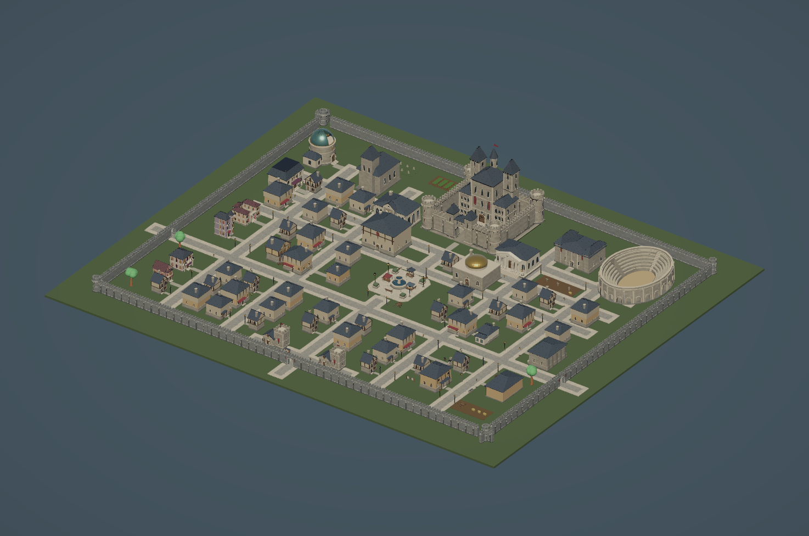
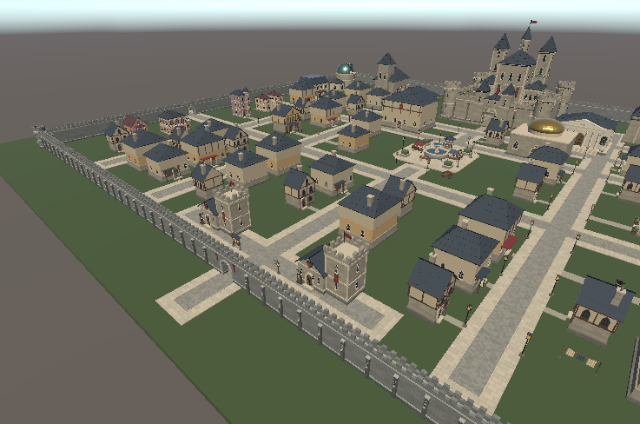
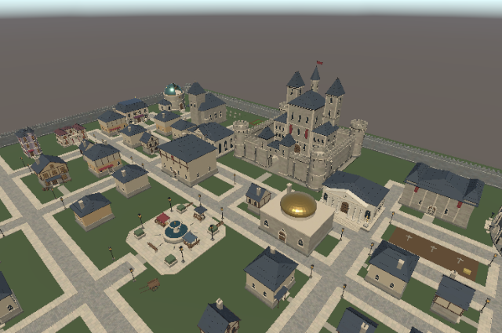

# Country 王国配置

`Assets/Scenes/Country.unity` に、中世ヨーロッパ風ファンタジーの城壁都市を配置した。城壁内は208×168m、確認用地面は240×200m。最初の試作より城壁内面積を約2倍に広げ、南門から王城までの都市軸と、東西の副門へ抜ける生活・物流動線を構成している。

## 都市構成

- 南門から中央広場、ギルド会館・浴場、図書館・美術館を経て王城へ至る主街道を中心軸にした。南門外、東西副門外まで道路が連続する。
- 王城は北側の高位区画に置き、兵舎・訓練場を北東、礼拝堂・墓地・菜園・天文台を静かな北西へ分けた。
- 闘技場は東門寄り、倉庫・厩舎・穀物庫・鍛冶場は南東の物流地区、酒場・パン工房・市場は中央西側にまとめた。
- カジノと4種の歓楽街建物は西門側に集約し、診療所は東住宅区と中央部の双方から到達しやすい位置に置いた。
- 住宅には民家、商人邸、工房付き住宅を混在させた。門前広場、共同菜園、墓地、訓練場、荷車置場、生活樹、樽・木箱を用途のある空間として配置した。
- 花崗岩の城壁94モジュールで囲み、南に正門、東西に副門を設けた。北辺は防御を優先して閉じている。

シーン内の `Kingdom` 以下は、土地、城壁、道路、入口接続、王城・軍事、公共文化、東西住宅、市場物流、歓楽街、管理された空地、生活庭、公共設備に分けている。

## Blender・Unity作成物

- Blender原本から40種類をFBX化し、BaseColor、Normal、MetallicSmoothnessをベイクした。UnityではURP/Litマテリアルと配置用Prefabを生成している。
- 不足していた穀物庫、倉庫、パン工房、厩舎、兵舎、ギルド会館、公衆浴場、礼拝堂、商人邸、工房付き住宅の10種類を `ArtSource/Blender/FantasyKingdomSupportBuildings.blend` に追加した。
- 既存の道路、民家、露店、街灯、樽、木箱などは `Assets/Prototypes/TownBlock/Prefabs/` から再利用した。生活樹は既存のNaturalTreesから、建物・道路との干渉がない候補だけを配置した。
- Unity側の再生成処理は `Assets/Prefabs/Kingdom/City/Editor/KingdomCityBuilder.cs`。既存シーン全体ではなく `Kingdom` ルートのみを作り直す。

## 最終検証

- 配置Prefabは410個。城壁94、道路163、建物62、集計対象の生活小物91。
- 城壁内の建物占有率は24.79%。道路と用途を与えた広場・作業場を含む開発済み面積率は56.25%。残る緑地には防火間隔、裏庭、城壁沿いの警戒空間を含む。
- 重要施設10棟はすべて標準サイズより拡大した。王城1.35倍、闘技場1.30倍、図書館・美術館・天文台1.25倍など、都市内の階層が俯瞰で判別できる。
- 全62棟が城壁内に収まり、建物同士の重なりは0。建物間の記録上の最短距離は約1.81m。
- 全62入口の接続先が道路上にあり、南門外から王城前まで道路グラフが連続する。道路座標の重複は0。
- 大きな中庭用の平面メッシュは廃止した。地面上端と道路面には約0.05mの高低差があり、道路と地面の同一平面重なりは0。
- 新規Prefab40種類のMesh、URP/Litマテリアル、3種のテクスチャ参照をUnity上で検証した。UnityコンソールのErrorは0件で、Countryシーンは保存済み。

数値と全配置は [unity_validation.json](unity_validation.json)、出力元・寸法・ポリゴン数・テクスチャ解像度は [export_manifest.json](export_manifest.json)、自己レビューの修正記録は [review_iterations.json](review_iterations.json) に記録した。元の空だったCountryシーンのハッシュは [Country.before.sha256](Country.before.sha256)。







## 再生成

Blender原本とFBX・テクスチャは次の順で再生成する。

```sh
/Applications/Blender.app/Contents/MacOS/Blender --background --factory-startup --python-exit-code 1 --python Tools/Blender/generate_kingdom_support_buildings.py
/Applications/Blender.app/Contents/MacOS/Blender --background --factory-startup --python-exit-code 1 --python Tools/Blender/KingdomCity/export_city.py
```

Unity側はCountryシーンを開き、未保存変更がない状態で `WarSim > Kingdom > Build Country City` を実行する。処理の最後に配置検証を行い、条件を満たさない場合はシーンを正常完了として保存しない。

## 現在の限界

- 外観と街路配置の段階で、住民、室内、NavMesh、店の営業時間、荷物の搬入、門扉の開閉、城壁上の巡回動作は未実装。
- LOD、簡略Collider、Occlusion Culling、実機性能は未検証。王城、闘技場、露店など細部の多いモデルは最適化候補。
- 平地の城壁都市で、高低差、河川、農地、城外集落は含まない。残る緑地を住宅で完全に埋めると防火・採光・家畜・作業空間が失われるため、用途のある余白として残している。
