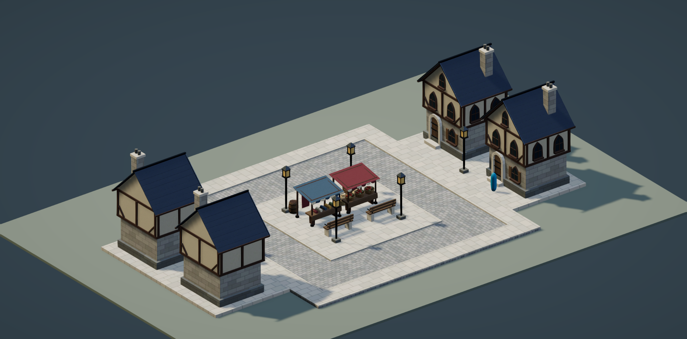
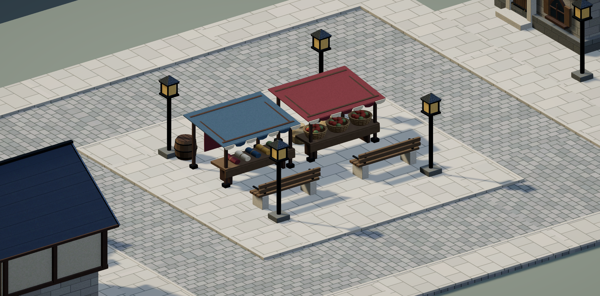
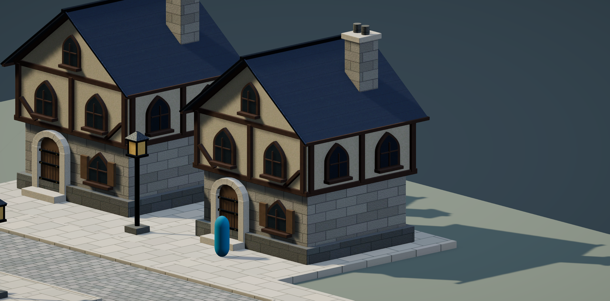

# Unityで確認する街の試作区画

## 範囲と確認条件

既存Blender原本から、民家・直線道路・曲がり道路・敷地舗装・青果露店・布露店・街灯・ベンチ・木箱・樽を取り込み、URPのマテリアルを備えた配置用Prefabと、確認用の一区画を作る。

- 原本の模型と質感からFBXとテクスチャを出力し、ゲーム本体とは別の `Assets/Prototypes/TownBlock/` に置く。
- Unityで読み込まれる寸法・親のスケール・接地位置を原本と照合する。道路は8mピッチ、車道の高さ0m、歩道0.12mを保つ。
- 道路同士の端と高さが一致し、車道がつながることを実データで確認する。
- 民家・露店が道路の通行部分や隣の建物を塞がず、配置間隔を確保する。
- 専用シーンを保存し、ゲームカメラの全景・近景を撮影して外観を確認する。
- 原本・既存シーン・プロジェクト設定を変更しない。ファイル整理と削除は行わない。

今回の試作は配置と描画の確認用。住民AI・ゲーム内建築システム・通行制御・NavMesh・最終端末での性能保証は含めない。

## 保存先

- Unity素材・シーン：`Assets/Prototypes/TownBlock/`
- 原本からの出力処理：`Tools/Blender/UnityTownBlock/export_block.py`
- 確認画像・検証結果：このフォルダ

原本を生成スクリプトで作り直すことはせず、保存済み `.blend` を読み取る。書き出し用の複製だけを結合・UV展開する。

## 完成した区画

住宅4棟と、中央の青果・布の露店を囲む環状道路。既存の剣と魔法のファンタジー向け原本を使い、新しい建物のデザインは追加していない。

| 配置用Prefab | 区画内の数 | 三角形数／個 |
| --- | ---: | ---: |
| Fantasy_House（民家） | 4 | 13,420 |
| Road_Straight（直線道路） | 4 | 156 |
| Road_Corner（曲がり道路） | 4 | 156 |
| Paved_Plot（敷地舗装） | 5 | 12 |
| Produce_Stall（青果露店） | 1 | 32,592 |
| Cloth_Stall（布露店） | 1 | 4,460 |
| Streetlamp（街灯） | 6 | 1,300 |
| Bench（ベンチ） | 2 | 1,188 |
| Crate_Closed（木箱） | 1 | 3,024 |
| Barrel（樽） | 1 | 1,072 |

合計10種類、29個のPrefabインスタンス。別に確認用地面、身長1.8mの水色のカプセル、カメラ、照明、色調整Volumeを置いた。

FBXに加え、原本のプロシージャルな質感をBaseColor・Normal・MetallicSmoothnessの30枚へベイクした。URP/Litのマテリアルはモデルごとに1個。石・木・漆喰・屋根・布の色と凹凸を保ち、シーン内の照明とACESで昼の見え方を調整した。Unity共通のURP設定は変更していない。

## Unityで見る・配置する

1. `Assets/Prototypes/TownBlock/TownBlockReview.unity` を開き、Gameビューを表示する。Playでも同じ区画を確認できる。
2. `Assets/Prototypes/TownBlock/Prefabs/` のPrefabをSceneビューへドラッグする。
3. 道路・敷地舗装はY=0、8mグリッドで配置する。歩道・敷地舗装の上に置く建物や小物はY=0.12。Prefabの親スケールは `(1,1,1)` を保つ。
4. この出力の民家・露店の正面はローカル-Z。民家は道路へ、露店は客の立つ側へ向けて回転する。曲がり道路は実際の車道の口を合わせる。

原本：民家は `ArtSource/Blender/KingdomBuildings_RealisticFantasy.blend`、その他は `ArtSource/Blender/FantasyTownProps.blend`。Unityには原本をコピーせず、FBXとテクスチャだけを取り込んでいる。

## 検証結果

環境：Blender 5.0.0、Unity 6000.4.3f1、URP 17.4.0、macOS Editor。現在のビルド対象はWebGLだが、WebGLビルドや実機測定は今回行っていない。

| 条件 | 結果と証拠 |
| --- | --- |
| 寸法・スケール | 10種類のUnity寸法が原本の軸変換後の寸法と一致。全配置の親スケールは1。民家は約6.24×9.495×5.765m、比較用カプセルは高さ1.8m。 |
| 接地 | 基準高さを照合し、建物・小物の底面924頂点で舗装面へのレイキャストが接地位置と一致。 |
| 道路接続 | 8か所の隣接道路で車道の端・高さを照合。8mピッチ、車道Y=0、歩道Y=0.12。縁石の上端はこれより少し高い原本形状を維持。 |
| 間隔 | 民家間の最短間隔は約2.56m。建物・露店と車道の最短距離は約2.27m。建物・露店の境界ボックス同士の重なりなし。 |
| 読み込み・URP | Prefab10個に欠けたMeshなし。URP/Litと3種類のテクスチャ参照がすべて有効。 |
| ゲームカメラ | 全配置モデルの境界が画面内。全景・露店・民家を実際に撮影して確認。再生モードのGameビューも撮影済み。最後は再生を止め、全景のカメラへ戻した。 |
| 原本・本体の保全 | 作業前後のSHA-256比較で、使用した原本2個・既存シーン・ProjectSettingsの計40ファイルに変更なし。ビルド設定への試作シーン追加なし。既存のPython群などの整理・削除なし。 |

寸法・接地・接続の実測は [unity_validation.json](unity_validation.json)、書き出し元・寸法・ポリゴン・テクスチャ解像度は [export_manifest.json](export_manifest.json)、最終確認は [final_review.json](final_review.json) に保存。保全対象の作業前ハッシュは [preserved_files.json](preserved_files.json)。







## 残っている部分

- 大きな街向けの軽量化は未実施。特に青果露店の32,592三角形は籠などの細部を含むため、遠景用LODや形状削減の候補。民家は4Kの個別アトラスで、全素材を同じ方式で大量展開した場合のメモリ・描画負荷は未測定。
- 今回は検証のためMeshのRead/Writeを有効にし、静的MeshColliderを付けた。大量配置では検証と実行時の設定を分け、簡略Collider・LOD・共有マテリアルなどを検討する。NavMesh、住民の通行、建物への出入り、夜間照明、ゲーム機能との接続は未実装。
- 再生／Gameビュー撮影時に `Ignoring depth surface load action as it is memoryless` と `Ignoring depth surface store action as it is memoryless` がUnityのError分類で記録された。画面の生成・表示は確認できたが、描画バックエンドと撮影経路のどちらに起因するかは未分離。コンパイルエラーではない。対処のためにゲーム共通の描画設定を変更することはしていない。
- 寸法の原本一致は確認済みだが、民家の高さや間隔がゲーム全体の好みに合うかはこの区画で判断する段階。民家は同じ1種類を4棟使っている。

## MCPで使えなかった機能と代替

| 機能 | 制約・理由 | 今回の代替 |
| --- | --- | --- |
| Blender原本からのFBX出力・質感ベイク | Unity MCPにはBlenderを直接編集・ベイクする機能がない。 | インストール済みBlenderのバックグラウンド実行で、原本を読み取り、複製のみを書き出した。 |
| `import_model_file` 専用インポート | 接続中のWarSimulationのカスタムツールに公開されていなかった。 | MCPの `execute_code` からUnityのAssetDatabaseとModelImporterを利用。 |
| 独自処理による連続カメラ撮影 | URPの `SingleCameraRequest` を同期的に続ける方法ではForward+の `ZBinningJob` 例外と黒い画像が発生。 | 独自撮影処理を除き、MCP標準の `manage_camera` で個別撮影。最終画像は目視確認済み。 |

FBX・Prefab・区画の完成を妨げる未対応機能は残っていない。

## 再生成と全素材への展開方針

この試作のFBXとテクスチャを再出力する場合は、プロジェクトルートから次を実行する。既存Blender原本は保存しないが、試作フォルダの出力は上書きする。

```sh
/Applications/Blender.app/Contents/MacOS/Blender --background --factory-startup --python-exit-code 1 --python Tools/Blender/UnityTownBlock/export_block.py
```

Unity側は `WarSim > Prototypes > Build Town Block Review` で、試作専用のマテリアル・Prefab・区画・数値検証結果を再生成できる。試作シーンに手で加えた配置も上書きされるので、残したい配置は別名保存する。未保存のシーンが開いている場合とPlay中は、上書き事故を避けるため処理を止める。確認画像はMCPのカメラ撮影で別途更新する。

全素材へ広げるときは、まずこの区画でカメラ距離・建物の大きさ・道路幅の方針を固める。その後、既存の素材カタログを使って、同じ原本読み取り方式で必要な種類を順にFBX化し、各モデルの原点・正面・接地・寸法を検証する。質感を保つためのベイクは今回の方式を基準にできるが、全モデルへ4Kを一律適用せず、画面での大きさと必要な細部に合わせる。

城壁の色違いなど形状が同じ素材はメッシュを共有し、マテリアルやPrefab Variantで分ける。道路は直線・角に加えて交差点・終端を接続検証する。代表的な大型建築を加えた街で描画時間・テクスチャメモリ・衝突処理を測定し、その結果からLODや簡略Colliderを決めてから大量配置へ進む。今回、全素材への一括展開や原本整理は行っていない。
